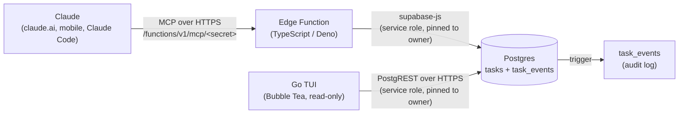

# taskd

A personal task manager where Claude is the main interface. You ask Claude things like *"what's on today, sorted by priority?"* or *"push the logbook task to Friday"*, and Claude reads and edits a Supabase Postgres database through a custom, hand-written MCP server. A Go terminal UI gives a quick keyboard-driven view of the same tasks.

Built as a learning and portfolio project, with a focus on backend and security design.

**Status:** v0.9.0. The database, MCP server and a read-only terminal UI work. Editing and OTP login come in v1.0.

## How it works



- **MCP server**: a Supabase Edge Function that implements the MCP protocol by hand (JSON-RPC over stateless Streamable HTTP, no SDK). It supports protocol versions `2025-06-18` and `2025-03-26`.
- **Database**: Postgres with Row Level Security, triggers for timestamps and auditing, and pgTAP tests.
- **Terminal UI**: a read-only Go app built with [Bubble Tea](https://github.com/charmbracelet/bubbletea) that shows your tasks by day, week or month. It calls Supabase's REST API (PostgREST) directly with `net/http`.
- **Time zone**: all "today" logic uses `Asia/Kuala_Lumpur`, in both the MCP server and the TUI.

## Security design

| Concern | How it's handled |
|---|---|
| Endpoint access | A 64-character secret as the last URL segment, compared in constant time (both sides hashed with SHA-256 first, so length doesn't leak either). A wrong secret gets a plain `404`, so the endpoint doesn't reveal it exists. |
| Service-role blast radius | The function uses the service role key, so every query is explicitly pinned to `OWNER_USER_ID`. |
| Over-posting | Writes go through an allow-list (`pick()`), so Claude can only set known task fields. |
| Destructive actions | The MCP server has no delete tool, so Claude can only archive tasks. The RLS policy still lets a signed-in user delete their own rows, and every delete is recorded in `task_events`. |
| Accountability | An `after insert/update/delete` trigger writes every change to `task_events`, labelled `claude` (service role), `user` (authenticated JWT) or `system` (no JWT). |
| Audit integrity | `task_events` is select-only for clients (there's no insert, update or delete policy), so signed-in users can't forge or edit history; only the trigger writes it. The service role bypasses RLS, so anyone holding that key (the MCP server, and the TUI until OTP login) could still write to it directly. |
| Trigger hardening | Trigger functions run with `set search_path = ''` and fully qualified names, to prevent search-path hijacking. |
| Tenant isolation | RLS policies (`user_id = (select auth.uid())`) on both tables, verified by pgTAP tests. |
| Secrets in git | `.env` files are git-ignored. Production secrets live in `supabase secrets`. |
| TUI credentials (v0.9) | The TUI is read-only (GET requests only). Its key lives in a user environment variable, never in the repo. One function adds the owner filter to every query, the user ID and dates are validated before they reach the query string, and `https` is enforced. Only the `store` package ever sees the key. Temporary until OTP login (see To-Do). |

For the threats, mitigations and known limits, see the [threat model](docs/threat-model.md). To report a vulnerability, see [SECURITY.md](SECURITY.md).

## MCP tools

| Tool | What it does |
|---|---|
| `list_tasks` | List tasks (open ones by default), filtered by status, area, planned date or due date |
| `get_summary` | Open tasks by area, overdue count, and tasks and minutes planned for today |
| `add_task` | Create a task |
| `update_task` | Change fields on one task |
| `complete_task` | Mark a task done |
| `archive_task` | Archive a task (Claude can't delete tasks) |
| `reorder_tasks` | Set `sort_order` and/or `priority` on up to 50 tasks |
| `get_task_history` | Recent changes to a task and who made them, for review or undo |

Priority runs from **1** (urgent and important) to **4** (someday). Dates are `YYYY-MM-DD` or `today`.

## Data model

**`tasks`**: `title`, `notes`, `status` (`todo` · `doing` · `done` · `archived`), `priority` (1–4), `area`, `tags[]`, `planned_for` (the day you intend to work on it), `due_date` (the hard deadline), `estimate_minutes`, `sort_order`, plus `completed_at`, `created_at` and `updated_at`, which the triggers maintain.

**`task_events`**: an append-only audit log with `actor`, `action`, and `old_row` / `new_row` stored as `jsonb`.

## Project layout

```
taskd.env.example             # TUI config template (no real values)
cmd/taskd/main.go             # TUI entry point: reads config, starts the app
internal/
├── store/                    # Supabase REST client (the only code that sees the key)
└── tui/                      # Bubble Tea model, views, date logic
scripts/install-taskd.ps1     # Windows: build the TUI and add it to your user PATH
scripts/install-taskd.sh      # Linux: same, installs to ~/.local/bin
supabase/
├── functions/.env.example    # MCP server config template (no real values)
├── config.toml               # local stack config (verify_jwt = false for the mcp function)
├── migrations/               # schema, triggers, RLS
├── functions/mcp/
│   ├── index.ts              # entry point + secret check
│   ├── mcp.ts                # JSON-RPC / MCP routing
│   ├── tools.ts              # tool names, descriptions, JSON Schemas
│   └── tasks.ts              # database queries
├── tests/rls_test.sql        # pgTAP: RLS, audit log, trigger behaviour
└── seed.sql                  # local-only sample user + tasks
```

## Configuration

**New here? Read the two config templates first.** taskd has two separate programs that reach Supabase in different ways, so each has its own template, kept next to what uses it:

| Template | Used by | Values | Where the real values go |
|---|---|---|---|
| [`supabase/functions/.env.example`](supabase/functions/.env.example) | MCP server | `MCP_SECRET` (generate it), `OWNER_USER_ID` | `supabase/functions/.env` locally, `supabase secrets` when hosted |
| [`taskd.env.example`](taskd.env.example) | Terminal UI | `TASKD_SUPABASE_URL`, `TASKD_SERVICE_ROLE_KEY`, `TASKD_USER_ID` | Your environment: `~/.config/taskd/env` on Linux, user environment variables on Windows |

Each template explains every value: what it is, whether it's a secret, and how to get or generate it. The templates are committed and hold no real values. The files with real values are git-ignored or live outside the repo.

## Running locally

Requires Docker, the [Supabase CLI](https://supabase.com/docs/guides/cli) and Deno.

```bash
supabase start                 # local Postgres, API and Studio in Docker
supabase db reset              # apply migrations + seed data
supabase test db               # run the pgTAP tests
```

Copy the MCP template and fill it in (for the seeded local user, `OWNER_USER_ID=00000000-0000-0000-0000-000000000001`):

```bash
cp supabase/functions/.env.example supabase/functions/.env
```

Then serve the function:

```bash
supabase functions serve mcp --env-file supabase/functions/.env
```

The local endpoint is `http://127.0.0.1:54321/functions/v1/mcp/<MCP_SECRET>`. Test it with the [MCP Inspector](https://github.com/modelcontextprotocol/inspector) or Claude Code.

## Terminal UI

Requires Go 1.26 or newer.

The TUI reads three environment variables: `TASKD_SUPABASE_URL`, `TASKD_USER_ID` and `TASKD_SERVICE_ROLE_KEY`. [`taskd.env.example`](taskd.env.example) explains where to find each one. Set them as shown below, then run the install script for your OS. Both install scripts run the Go tests, build the binary, and add its folder to your PATH once, with no admin rights or sudo. Rerun the script after pulling new code to rebuild.

### Windows (PowerShell)

Set the variables for your user. Type the key at a hidden prompt so it never lands in your shell history:

```powershell
[Environment]::SetEnvironmentVariable("TASKD_SUPABASE_URL", "https://<project-ref>.supabase.co", "User")
[Environment]::SetEnvironmentVariable("TASKD_USER_ID", "<your auth user id>", "User")
$s = Read-Host "Service role key" -AsSecureString
[Environment]::SetEnvironmentVariable("TASKD_SERVICE_ROLE_KEY", [System.Net.NetworkCredential]::new("", $s).Password, "User")
Remove-Variable s
```

Open a new terminal, then install:

```powershell
powershell -ExecutionPolicy Bypass -File .\scripts\install-taskd.ps1
taskd
```

This installs `taskd.exe` to `%LOCALAPPDATA%\Programs\taskd`. Options: `-SkipTests` skips the tests, and `-Uninstall` removes the exe and the PATH entry.

### Linux (bash or zsh)

Copy the TUI template to a file only you can read, fill in the three values, and load it from your shell's rc file:

```bash
mkdir -p ~/.config/taskd
install -m 600 taskd.env.example ~/.config/taskd/env
nano ~/.config/taskd/env      # fill in the three values
echo '[ -f ~/.config/taskd/env ] && . ~/.config/taskd/env' >> ~/.bashrc   # or ~/.zshrc
```

Open a new terminal, then install:

```bash
./scripts/install-taskd.sh
taskd
```

This installs `taskd` to `~/.local/bin` (set `TASKD_INSTALL_DIR` to change it). If that folder isn't on your PATH yet, the script adds one line to `~/.bashrc` or `~/.zshrc`. Options: `--skip-tests` skips the tests, and `--uninstall` removes the binary and that line.

### Development

Run it without installing:

```bash
go test ./...
go run ./cmd/taskd
```

| Key | Action |
|---|---|
| `j` / `k`, `↓` / `↑` | Move |
| `Tab`, `1` `2` `3` | Day / Week / Month |
| `←` / `→`, `t` | Previous / next period, back to today |
| `Enter`, `Esc` | Task details, back |
| `h` | Hide or show finished tasks |
| `r`, `q` | Refresh, quit |

## Deploying

```bash
supabase link --project-ref <project-ref>
supabase db push                                   # apply migrations to the hosted database
supabase secrets set MCP_SECRET=<secret> OWNER_USER_ID=<your auth user id>
supabase functions deploy mcp
```

Then add `https://<project-ref>.supabase.co/functions/v1/mcp/<secret>` as a custom connector in Claude.

Use a different `MCP_SECRET` in production than locally. See [`supabase/functions/.env.example`](supabase/functions/.env.example) for how to generate it and where to find your user ID.

## To-Do

### Go CLI / TUI
- [x] Read-only Bubble Tea TUI with Day, Week and Month views (v0.9)
- [x] Embed `time/tzdata` so "today" is Malaysia time on any machine
- [ ] Replace the service role key in the TUI with email OTP login (user JWT, so RLS applies)
- [ ] `taskd login`: sign in with an email OTP code from Supabase Auth
- [ ] Store the refresh token in the OS keyring with `go-keyring` (Windows Credential Manager, Linux Secret Service), never in a plain file
- [ ] Editing in the TUI: mark done, add, reschedule
- [ ] `taskd today`, `taskd add`, `taskd done`: one-shot commands for scripts

### Auth
- [ ] Finish email OTP: custom SMTP plus `{{ .Token }}` in the Magic Link template
- [ ] Replace the URL secret with OAuth 2.1 for the MCP connector (Supabase Auth as the authorization server)
- [ ] Have the MCP server act as the signed-in user instead of the service role, so RLS covers the Claude path too

### Security and CI
- [ ] gitleaks pre-commit hook
- [ ] GitHub Actions: `supabase test db`, `deno check` / `deno lint`, Go tests, gitleaks
- [ ] Branch protection on `main`

### Later
- [ ] Push reminders with ntfy, triggered by `pg_cron`
- [ ] Web app with live updates via Supabase Realtime

## License

MIT. See [LICENSE](LICENSE).
