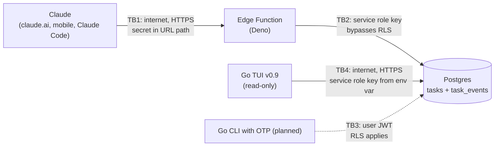

# taskd threat model

Version: v0.9.0 · Last reviewed: 2026-10-09

This document lists what taskd protects, who might attack it, what stops them, and what risk is left over. It uses [STRIDE](https://learn.microsoft.com/en-us/azure/security/develop/threat-modeling-tool-threats) to group threats.

## 1. System overview

**Trust boundaries**
- **TB1, Claude to Edge Function.** Anything on the internet can reach the function URL. The only gate is the URL secret.
- **TB2, Edge Function to Postgres.** The function uses the service role key, which bypasses RLS. Here the TypeScript code is the security boundary.
- **TB3, CLI to Postgres (planned).** The CLI signs in as the user. Postgres RLS is the security boundary.
- **TB4, TUI to Postgres (v0.9, temporary).** The TUI calls PostgREST with the service role key, which bypasses RLS. The Go `store` package is the security boundary, and the key sits on my PC. This goes away when the TUI moves to TB3.

## 2. Assets

| Asset | Why it matters |
|---|---|
| Task data (titles, notes, dates) | Personal information about my life and schedule |
| `MCP_SECRET` | Full read/write access to my tasks through the MCP tools |
| Service role key | Root access to the whole Supabase project, RLS bypassed. Held by the Edge Function and, in v0.9, by the TUI on my PC |
| `task_events` audit log | The only record of who changed what, needed for review and undo |
| Supabase account and GitHub repo | Control over deployment and source code |

## 3. Attackers and assumptions

- **Internet scanner or opportunist.** Finds the Supabase functions URL pattern and probes it.
- **Someone who sees my logs, screenshots or config.** Could pick up a secret by accident.
- **Prompt injection through content Claude reads.** Text in a task note, an email or a web page tells Claude to change or wipe tasks.
- **Malware or another program on my PC.** Anything running as my Windows user can read my environment variables.
- **Supply chain.** A compromised npm, JSR or Go module dependency.

Assumptions: Supabase and Anthropic platforms are trusted. There is one user (me). TLS is handled by Supabase.

## 4. Threats and mitigations

| # | STRIDE | Threat | Mitigation | Residual risk |
|---|---|---|---|---|
| T1 | Spoofing | Attacker calls the MCP endpoint as if they were Claude | 256-bit secret in the URL; constant-time compare of SHA-256 hashes; fails closed if the secret is unset | Static shared secret with no expiry and no per-client identity |
| T2 | Info disclosure | Secret leaks through request logs, screenshots or a shared config, because it's in the URL | `.env` and `secret.md` git-ignored; production secret in `supabase secrets`; rotation runbook written | URLs are logged more often than headers. Fix: OAuth 2.1 with a bearer token (roadmap) |
| T3 | Info disclosure | Scanner discovers the endpoint exists | Wrong secret returns `404`, not `401` | Obscurity only; the URL pattern is public |
| T4 | Elevation of privilege | A code bug in the function reads or edits another user's rows (service role bypasses RLS) | Every query pinned to `OWNER_USER_ID` | One missing `.eq()` would be a leak. Fix: act as the user so RLS applies (roadmap) |
| T5 | Tampering | Claude (or injected instructions) sets fields it shouldn't, such as `user_id` | `pick()` allow-list on writes; JSON Schemas on every tool | Values inside allowed fields are still trusted |
| T6 | Tampering | Prompt injection makes Claude destroy data | No delete tool, only archive; every change in `task_events`; `get_task_history` for undo | Claude can still edit or archive many tasks; recovery is manual |
| T7 | Repudiation | A change happens and nobody can tell who did it | `after` trigger records actor (`claude` / `user` / `system`), action, old and new row | Actor is inferred from the JWT role, not a real identity |
| T8 | Tampering | A client forges or edits audit history | No insert/update policy on `task_events`; pgTAP test proves inserts fail with `42501` | The service role can still write it directly |
| T9 | Elevation of privilege | Search-path hijacking of the `security definer` trigger | `set search_path = ''` and schema-qualified names | None known |
| T10 | Info disclosure | A second user reads my tasks or history | RLS `user_id = (select auth.uid())` on both tables; pgTAP tests | Only covers the JWT path (TB3), not the service-role paths (TB2, TB4) |
| T11 | Denial of service | Request flood runs up function invocations | Supabase platform limits | No app-level rate limiting |
| T12 | Tampering | Malicious dependency update | Imports use major-version ranges (`@2`) | No lockfile pinning or dependency scanning yet. Fix: pin versions, add Dependabot |
| T13 | Info disclosure | Secret committed to git by mistake | `.gitignore`; gitleaks run before going public | No pre-commit hook or CI scan yet (roadmap) |
| T14 | Elevation of privilege | The TUI's service role key leaks from my PC. It's stored as plain text in `HKCU\Environment`, readable by any process running as me | Key entered at a hidden prompt (not in shell history); never in the repo; can be a dedicated `sb_secret_` key revoked on its own; only the `store` package reads it | Anyone with the key can read and write every row. Fix: OTP login with the user's JWT so RLS applies (roadmap) |
| T15 | Elevation of privilege | Filter injection: a crafted user ID or date changes the PostgREST query (e.g. `x,user_id.neq.x`) and returns other users' rows | Config rejects a user ID that isn't a UUID; dates re-validated as `YYYY-MM-DD`; the owner filter is added last in one function so callers can't drop it; Go tests cover each case | Relies on every new query going through the same function |
| T16 | Info disclosure | Key sniffed in transit by a misconfigured URL | The TUI refuses non-`https` URLs except `127.0.0.1` / `localhost` | None known |
| T17 | Tampering | The TUI accidentally changes data | Read-only by design: the client only sends `GET` | Goes away as a guarantee once editing is added; revisit then |
| T18 | Spoofing | A stranger uses the public anon (publishable) key to sign up, gets a real `authenticated` session, and uses up my email quota or probes RLS from the inside | Public sign-ups disabled in the dashboard and with `enable_signup = false` in `supabase/config.toml`; RLS limits any account to its own rows | An account created by me or by the service role still gets in. When OTP login lands, the CLI must call `signInWithOtp` with `shouldCreateUser: false`, so a typo'd or unknown email can't create a user |

## 5. Planned improvements

These are tracked as GitHub issues in the v1.0.0 milestone or later:
- OTP login for the TUI, replacing the service role key with the user's JWT (T14, T15). It must send `shouldCreateUser: false` (T18).
- OAuth 2.1 for the connector, with the token in an `Authorization` header (T1, T2).
- MCP server acting as the signed-in user so RLS covers Claude too (T4, T10).
- gitleaks pre-commit hook and CI scan (T13).
- Pinned dependency versions and Dependabot (T12). Go modules are already pinned by `go.sum`.
- Rate limiting and alerting on failed secret checks (T11).

## 6. Review triggers

Update this document when a new trust boundary appears (the CLI, OAuth, a web app), when a tool is added, or after any security incident.
